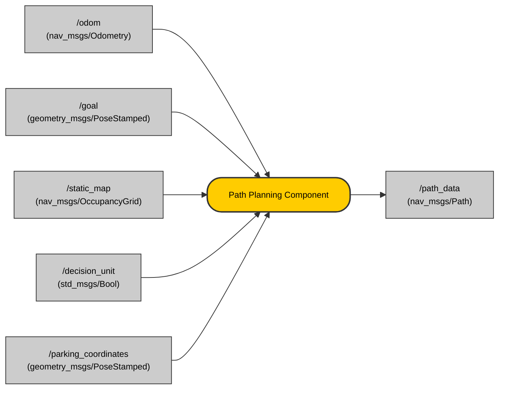

## Contents
- [Description](#description)
- [Architecture](#architecture)
- [Node Details](#node-details)
- [User Stories & Acceptance Criteria](#user-stories--acceptance-criteria)
- [Installation](#installation)
- [Usage](#usage)
- [License](#license)
 
## Description
The Path Planning Component is responsible for computing safe, optimal, and obstacle-free routes for the shuttle. It uses real-time data, including static maps of the environment, shuttle's current position (via odometry), and dynamic obstacle detection, to generate a series of waypoints that guide the shuttle from the pickup location to the drop-off point (e.g., supermarket)

## Architecture


## Node Details
### Node: `path_planner_node`
This node is responsible for computing a safe and optimal path from the shuttle's current position to the destination (either the parking spot, pickup, or drop-off point).

#### Topics & Services
##### Inputs

| Name                         | IO      | Type                      | Description                                                              |
|------------------------------|---------|---------------------------|--------------------------------------------------------------------------|
| `/odom`                       | Input   | `nav_msgs/Odometry`         | Provides the shuttle’s real-time position and orientation within the map. |
| `/goal`                       | Input   | `geometry_msgs/PoseStamped` | Receives the destination goal (pickup/drop-off or parking location). |
| `/map`                        | Input   | `nav_msgs/OccupancyGrid`    | Provides the static map of the environment, including obstacles. |
| `/decision_unit`              | Input   | `std_msgs/Bool`             | Receives a signal from the decision unit (boolean) to start path planning. |
| `/parking_coordinates`        | Input   | `geometry_msgs/PoseStamped` | Receives the parking spot coordinates to plan the path towards the parking area. |

##### Output

| Name                         | IO      | Type                      | Description                                                              |
|------------------------------|---------|---------------------------|--------------------------------------------------------------------------|
| `/path_data`                 | Output  | `nav_msgs/Path`           | Publishes the computed path as a sequence of waypoints to be followed by the shuttle. |


## User Stories & Acceptance Criteria
### User Story 1: Path Calculation from Start to Goal
**User Story 1.1**  
As a **Path Planning Component**, I want to dynamically calculate and adjust the shuttle's route based on its current position, destination, so that the shuttle can follow an optimal, and safe path to reach its destination, including parking and re-routing.
**Acceptance Criteria**  
- **1.1.1**  The system should calculate an initial valid path from the shuttle's current position (based on odometry) to the destination (either a pickup, drop-off, or parking spot), ensuring that it follows safe and efficient routes.
- **1.1.2** The system should publish a valid **`/path_data`** message representing the planned path to the destination.
- **1.1.3** The system should incorporate dynamic re-routing, allowing the shuttle to adjust its path if an obstacle is detected by the Environmental Model or Decision Unit and send a re-routing request to the Path Planning Component.


<!-- ### User Story 2: Dynamic Re-routing for Obstacle Avoidance
**User Story 2.1**  
As a **Path Planning Component**, I want to dynamically re-calculate the path when the **Decision Unit** informs me of the need to re-plan the path due to a detected obstacle, so that the shuttle can avoid collisions and continue safely to its destination.

**Acceptance Criteria**  
- **2.1.1** The **Environmental Model** detects obstacles and sends a **true/false signal** to the **Decision Unit** indicating whether an obstacle is detected.
- **2.1.2** The **Decision Unit** sends a command to the **Path Planning Component** to re-plan the path when an obstacle is detected.
- **2.1.3** Upon receiving the signal from the **Decision Unit**, the **Path Planning Component** invalidates the current path and recalculates a new one that avoids the detected obstacle.
- **2.1.4** The updated path should be published to the **`/path_data`** topic, guiding the shuttle around the obstacle.

### User Story 3: Path Planning for Parking
**User Story 3.1**  
As a **Path Planning Component**, I want to plan a route that allows the shuttle to reach the nearest available parking spot, so that the shuttle can park safely while waiting for the user to complete their shopping.

**Acceptance Criteria**  
- **3.1.1** The system should use the **`/parking_coordinates`** to calculate the path to the nearest available parking spot.
- **3.1.2** The system should publish a valid path to the parking spot, guiding the shuttle safely into the parking area without collisions.
- **3.1.3**  The system should dynamically adjust the path if the parking spot becomes unavailable or if there are new obstacles detected while approaching the parking spot. -->

 
## Installation
```bash
git clone https://git.hs-coburg.de/voyagex/vx_path_planning.git
```
 
## Usage
Run the node:
```bash
ros2 run xx xx
```
 
## Contributor
[Ravikumar Shivlal Savaliya](https://git.hs-coburg.de/ravisavaliya)
 
## License
Licensed under the **Apache 2.0 License**. See [LICENSE](LICENSE) for details.
 
 
