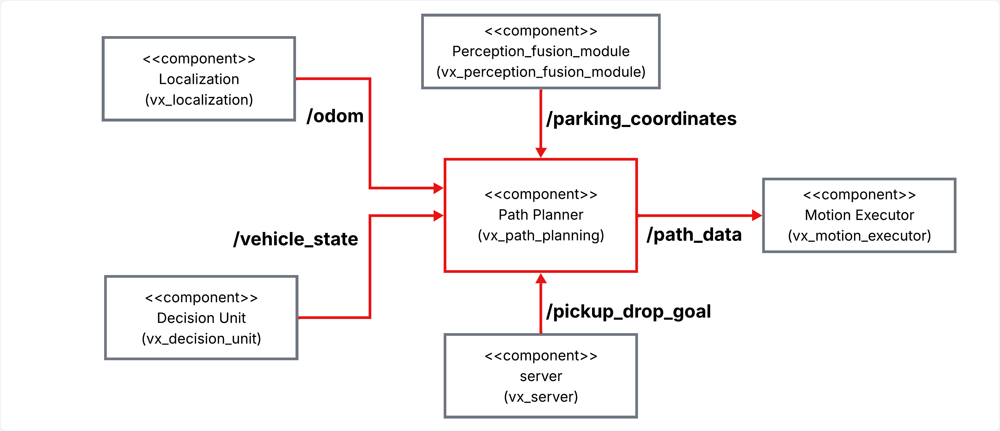
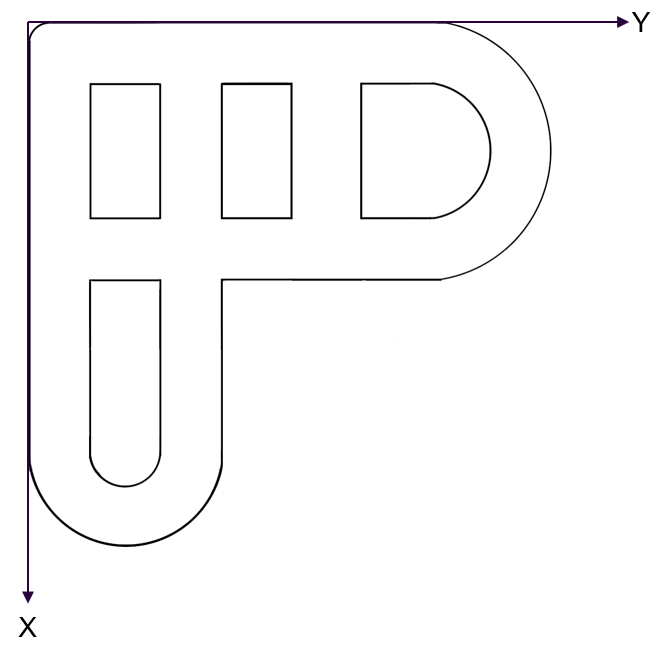
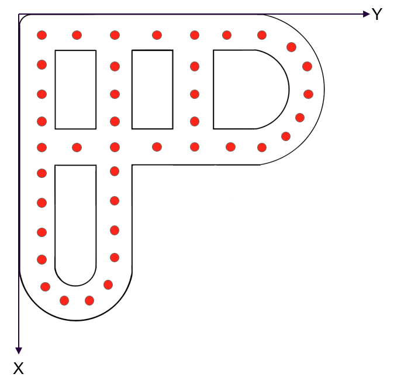

### Author: Ravikumar Savaliya

## 📌 Table of Contents
- [Overview](#-overview)
- [Component Architecture](#-component-architecture)
- [ROS 2 Topics](#-ros-2-topics)
- [Component Functionalities](#-component-functionalities)
- [Installation & Setup](#-installation--setup)
- [Interface Test Procedure](#-interface-test-procedure)
- [References](#-references)

---

## 📖 Overview

The **Path Planning Node** plays a central role in ensuring that the autonomous shuttle reaches its destination safely and efficiently. It calculates the route from the shuttle's current position to destinations like pickup points, drop-off points, or parking spots.

To achieve this, it uses:
- **Position and orientation** data from `/odom`.
- **Static graph** with nodes and edge defined on a map.
- **Pick-up and drop-off destination** via `/pickup_drop_goal`.
- **Vehicle state** from `/vehicle_state`.
- **Parking location** from `/parking_coordinates`.

Based on this, it generates a sequence of waypoints and publishes them on `/path_data`, which can then be followed by a controller node.

---

## 🏗️ Component Architecture




## 🔌 ROS 2 Topics

| IN/Out | Topic Name             | Message Type                | Description                                                     |
|--------|------------------------|-----------------------------|----------------------------------------------------------------|
| Input  | `/odom`                | `nav_msgs/Odometry`         | Current pose and orientation of the shuttle.                    |
| Input  | `/pickup_drop_goal`    | `vx_custom_msgs/GoalPoint`                 | Custom message with pickup/drop-off coordinates.                |.            |
| Input  | `/vehicle_state`       | `std_msgs/UInt8`            | Trigger signal from decision unit to start path planning.       |
| Input  | `/parking_coordinates` | `geometry_msgs/PoseStamped` | Nearest available parking spot to plan toward.                  |
| Output | `/path_data`           | `nav_msgs/Path`             | Computed path as a list of waypoints for the controller to use. |

### 📦 Custom Message Definition: `GoalPoint`

The `/pickup_drop_goal` topic uses a custom message type named `GoalPoint`, which includes both pickup and drop-off locations for the autonomous shuttle.

```text
GoalPoint.msg
------------------------
geometry_msgs/PoseStamped pickup
geometry_msgs/PoseStamped droppoff
```

### Field Description

| Field Name | Type                        | Description                                         |
| ---------- | --------------------------- | --------------------------------------------------- |
| `pickup`   | `geometry_msgs/PoseStamped` | Location where the user wants to be picked up. (Home)      |
| `droppoff` | `geometry_msgs/PoseStamped` | Destination location where the user is dropped off. (Super Market) |

--------------------

## ⚙️ Component Functionalities

The **Path Planning Node** starts planning only when it receives a trigger on the `/vehicle_state` topic.
This trigger comes from the decision unit. This prevents unnecessary planning and saves computation.

After being triggered, the node reads the shuttle’s current position and orientation from the `/odom` topic. The bumpere pose will be calculated from this pose, from where the vehicle plans the path.

Once triggered, the node begins by reading the shuttle's real-time pose and orientation from the `/odom` topic. At the same time, it listens to the `/pickup_drop_goal` topic, which contains the destination coordinates (a pickup and a drop-off point) specified by the user through the booking application(External-HMI).

After receiving all required inputs, the path planner generates a feasible heading-constrained path from current position to the next stop.

Once the path is computed, it is published to the `/path_data` topic as a `nav_msgs/Path` message. This message consists of a sequence of waypoints that the Motion Executor follows to drive the shuttle.


### Map Creation

The base map represents the overall driving environment of the shuttle.  


Red dots are nodes stored as `(x, y, nodeID)` into graph `yaml` file. .  


Edges connect two nodes and have a cost (Euclidean distance between the two nodes).  
They are described as `(N1, N2, cost)` into graph `yaml` file.  


### Algorithm Description

The Path Planning component uses a **heading-constrained A*** algorithm to compute a safe and feasible path on a graph.

The algorithm first maps the start pose and goal pose to their nearest graph nodes using Euclidean distance.
For the start node, the vehicle’s bumper is considered, which is calculated from the start pose of ego-vehicle.
If the nearest node requires a turn larger than **65 degrees**, the second-nearest node is selected instead.

Each A* state is defined as a pair:`(node_id, heading_angle)`.

During graph expansion, neighbor nodes are considered only if the direction to the neighbor lies within a **65 degrees** cone around the current heading. This constraint prevents sharp turns and ensures the path is drivable by the vehicle.

The heading-constrained A* search computes the optimal path using the cost function:
- g: accumulated edge cost
- h: Euclidean distance heuristic to the goal
- f = g + h

### Planned path with simple A*


### Planned path with Heading-Constrained A*


#### (The first node should be selected in the direction of the vehicle heading to ensure a drivable path, which is achieved using a heading-constrained A* algorithm.)

Once a node sequence is found, it is converted into a sequence of PoseStamped waypoints.

Once a node sequence is found, it is converted into a sequence of PoseStamped waypoints.
Yaw orientations are computed between consecutive waypoints and set into orientaion of corresponds node.

## Dependencies

1. Localization Node
2. Decision Unit Node
3. Custom Message Package


## 📥 Installation & Setup

### 🔧 Clone the repository

```bash
git clone https://github.com/Savaliya-Ravi/Path_planning.git
```

##  Build the package
```bash
cd vx_path_planning
colcon build
source install/setup.bash
```

 ## Run the node
```bash
ros2 run vx_path_planning path_planner
```

 ## 🧪 Interface Test Procedure

This section outlines how to verify that the **Path Planning Node** correctly subscribes to inputs and publishes the expected path output using ROS 2 topics.


### Step-by-Step Test Procedure

1. **Launch the Node**
   ```bash
   ros2 run vx_path_planning path_planner
   ```
   Run the dependency modules or use RQT message publisher or altrnatively create dummy publishers by pasting this each in new terminal.

2. **Publish Odometry Input**
   ```bash
   ros2 topic pub /odom nav_msgs/msg/Odometry "{
   pose: {
    pose: {
      position: {x: 1.5, y: 0.5, z: 0.0},
      orientation: {x: 0.0, y: 0.0, z: 0.0, w: 1.0}
     }
    }
   }"
   ```

3. **Publish Vehicle State Input**
   ```bash
   ros2 topic pub /vehicle_state std_msgs/msg/Int8 "{data: 1}"
   ```
   (Here data: 1 will generate path to pickup, data: 3 generates path to dropoff and data: 5 can generate path to parking) 

4. **Publish Pickup and Dropoff Input**
   ```bash
   ros2 topic pub /pickup_drop_goal vx_custom_msgs/msg/GoalPoint "{
   pickup: {
    header: {frame_id: 'map'},
    pose: {
      position: {x: 2.0, y: 1.0, z: 0.0},
      orientation: {x: 0.0, y: 0.0, z: 0.0, w: 1.0}
     }
   },
   dropoff: {
    header: {frame_id: 'map'},
    pose: {
      position: {x: 5.0, y: 2.5, z: 0.0},
      orientation: {x: 0.0, y: 0.0, z: 0.0, w: 1.0}
     }
    }
   }"
   ```

5. **Verify Output Path**
   ```bash
   ros2 topic echo /path_data
   ```
   Testing Commands
6. **Run Unit Tests** [result](https://git.hs-coburg.de/voyagex/vx_path_planning/src/branch/main/test/unit_test_report.txt)
   ```bash
   python3 -m pytest -v src/vx_path_planning/test/pytest_pathplanning.py
   ```

7. **Run Tests with Coverage**
   ```bash
   python3 -m coverage run --source=vx_path_planning -m pytest src/vx_path_planning/test/pytest_pathplanning.py
   ```
   
8. **Show Coverage Report** [result](https://git.hs-coburg.de/voyagex/vx_path_planning/src/branch/main/test/coverage_test_report.txt)
   ```bash
   python3 -m coverage report -m
   ```
 
9. **Generate HTML Coverage Report**
   ```bash
   python3 -m coverage html --directory=src/vx_path_planning/test/htmlcov
   ```

10. **Pylint Report** [result](https://git.hs-coburg.de/voyagex/vx_path_planning/src/branch/main/test/pylint_report.txt)
    ```bash
    cd src/vx_path_planning/vx_path_planning/
    pylint path_planner.py 
    ```

11. **Lizard Report** [result](https://git.hs-coburg.de/voyagex/vx_path_planning/src/branch/main/test/lizard_test.txt)
    ```bash
    cd src/vx_path_planning/vx_path_planning/
    lizard path_planner.py 
    ``` 


---

## 📚 References

1. ROS 2 Documentation (Humble) – https://docs.ros.org/en/humble/Tutorials.html
2. A* Path Planning Algorithm – https://git.hs-coburg.de/Autonomous_Driving/path_planning

